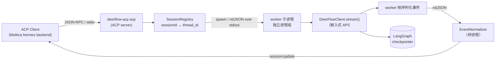

# deerflow-acp

DeerFlow 与 ACP（Agent Client Protocol）客户端之间的**独立桥接器**。

桥只负责协议层的事：ACP 方法实现、事件归一化、会话恢复、取消与进程生命周期。
它**不复制 DeerFlow 的研究编排能力**——所有编排、工具调用、模型选择、
记忆与检索仍然发生在 DeerFlow 内部，桥通过嵌入式 `DeerFlowClient` 消费其事件流。

## 架构



**每个 turn 一个 worker 子进程**，以 `start_new_session=True` 置于独立进程组。
这不是为了并行，而是为了**可终止**：DeerFlow 的模型调用与工具执行卡在
`next(generator)` 内部时，Python 线程无法被打断，进程可以。桥与 worker 之间
只走一条 ndJSON 管道（4 种消息 `ready` / `ev` / `done` / `err`），DeerFlow 对象
本身从不跨进程。

关键设计：

| 关注点 | 做法 |
| --- | --- |
| 会话映射 | ACP `sessionId` **就是** DeerFlow `thread_id`（同一字符串），桥不维护额外映射表 |
| 会话恢复 | 以 `DeerFlowClient.get_thread()` 是否返回 checkpoint 为唯一依据；不存在则报错，绝不静默新建 |
| 取消 | 协作式优先：`session/cancel` → 向 worker 进程组发 `SIGTERM`，worker 在下一个 yield 边界 `generator.close()`。宽限期由**事件循环侧**计时，因此后端即使卡在 yield **之前**（模型/工具调用还没返回），`session/prompt` 仍在宽限期内返回 `cancelled`；超时则 `killpg(SIGKILL)` 终止**整个进程组**（连带 DeerFlow 派生的工具子进程），并**等到进程确认退出后才释放 session**——旧 worker 不可能与下一个 turn 并发写同一条 thread |
| 进程隔离 | 每 turn 一个独立进程组的 worker 子进程；强杀后同 session 从 DeerFlow checkpoint 继续，不丢上下文 |
| 释放判据 | 释放 session 的条件是**整个进程组已排空**，不是「worker 主 PID 已退出」。DeerFlow 的工具可以派生留在同一 PGID 里的孙进程，它们不是桥的子进程、`waitpid` 看不到，只能靠 `killpg(pgid, 0)` 探活。所有退出路径（正常、协作取消、强杀、事件下发异常）统一先回收主进程再轮询到整组消失 |
| 会话隔离 | 无法确认进程组排空时，该 session **不可逆**隔离：后续 `prompt`/`resume`/`load` 返回 `-32012`，客户端需 `session/new`。pgid 仍留在在途集合里由关停兜底继续回收。`session/close` 若落在 turn 运行中则延后生效，堵住「close → resume → 新 prompt」的并发写窗口 |
| 孤儿回收 | 双闸：turn 协程被中断时同步 `killpg`；关停路径在宽限期后再兜底 `terminate_all_workers()`。stdin EOF、`SIGINT`/`SIGTERM`、异常退出三条路径都不留桥创建的孤儿进程 |
| stdout 纪律 | **两层** fd 隔离。桥进程与 worker 进程各自 `dup(1)` 出通道专用 fd 后 `dup2(2, 1)`：任何 `print`（含 C 扩展裸 `write`）物理上无法污染 JSON-RPC 流或 ndJSON IPC 流 |
| 跨进程错误 | worker 侧异常**只把类型名**送过 IPC 边界：消息、`args`、`__cause__`、traceback 一律不过河。凭据即使被某个 SDK 塞进异常消息也不可能到达桥进程 |
| 后端加载 | `initialize` 只回能力，不构造 `DeerFlowClient`；重型后端在首个真实请求时才拉起 |
| 凭据 | 桥不存储、不打印、不上传任何秘密；完全沿用 DeerFlow 既有的本地 `.env` 注入机制 |
| 秘密脱敏 | 所有离开进程的文本（JSON-RPC 响应体、stderr 日志、客户端可见事件）统一过 `sanitize.redact_text()`；对外错误只保留异常**类型名**等可诊断分类，不回显异常消息、traceback 与配置内容 |

## 安装

DeerFlow harness（`deerflow-harness`）**未发布到 PyPI**，只能以本地路径安装，
因此桥不把它声明为强依赖，而是要求运行环境里已经装好：

```bash
cd /home/guxy/Codes/offcial/deerflow-acp
uv venv -p 3.12
uv pip install --python .venv/bin/python /path/to/deerflow/backend/packages/harness
uv pip install --python .venv/bin/python -e '.[dev]'
```

自检 DeerFlow 运行时是否可用（不启动 ACP server）：

```bash
.venv/bin/deerflow-acp doctor
```

## 运行

```bash
deerflow-acp acp            # 在 stdio 上跑 ACP server
```

Multica 的 hermes backend 会无条件在 argv 末尾拼接 `acp`，所以在 Multica 里
只需要把命令配成 `/abs/path/to/.venv/bin/deerflow-acp`（不带子命令）。

## 配置

全部通过环境变量，桥自身不读写任何配置文件：

| 环境变量 | 默认 | 说明 |
| --- | --- | --- |
| `DEERFLOW_ACP_LOG_LEVEL` | `INFO` | 日志级别；日志**始终**写 stderr |
| `DEERFLOW_ACP_CONFIG_PATH` | 空 | DeerFlow `config.yaml` 路径；空则由 DeerFlow 自行解析 |
| `DEERFLOW_ACP_MODEL` | 空 | 覆盖 DeerFlow 默认模型名 |
| `DEERFLOW_ACP_THINKING` | `true` | 是否请求模型输出推理内容（映射为 `agent_thought_chunk`） |
| `DEERFLOW_ACP_CANCEL_GRACE_SECONDS` | `5` | 取消后等待 worker 协作退出的宽限期；超时即 `killpg(SIGKILL)` |
| `DEERFLOW_ACP_SHUTDOWN_GRACE_SECONDS` | `5` | 收到 SIGTERM/SIGINT 后等待在途 turn 收尾的时限 |
| `DEERFLOW_ACP_CONTEXT_WINDOW_TOKENS` | 空 | 上下文窗口大小；不设则**不下发** `usage_update` |
| `DEERFLOW_ACP_EMIT_USAGE_UPDATE` | `false` | 仅在同时设置了窗口大小时生效，见下方「usage 降级」 |

模板见 `config.example.env`。**该文件只放非秘密的行为开关**；模型 / 搜索
API key 一律走 DeerFlow 自己的 gitignored `.env`，桥不接触。

## 能力矩阵与降级

见 [`docs/compatibility.md`](docs/compatibility.md)。要点：

- **支持**：`initialize`、`session/new`、`session/load`、`session/resume`、
  `session/prompt`、`session/cancel`、`session/close`、流式
  `agent_message_chunk` / `agent_thought_chunk` / `tool_call` / `tool_call_update`。
- **显式降级**（返回 `-32601`，不伪造）：`authenticate`、`session/set_mode`、
  `session/set_model`、`session/set_config_option`、`session/fork`、`session/list`。
- **不上报**：`plan`（DeerFlow 无稳定的结构化计划事件源）、
  `session/request_permission`（DeerFlow 侧无权限询问回路）。
- **usage 降级**：ACP `usage_update` 的 `size`/`used` 表达上下文窗口占用，
  DeerFlow 只给 input/output/total token 增量，语义不同。默认**不发**
  `usage_update`，只在 `PromptResponse.usage` 里如实回传 token 数。

## 回退

桥不可用时的回退路径（按代价从低到高）：

1. `deerflow-acp doctor` 判定是 DeerFlow 运行时问题还是协议层问题。
2. 设 `DEERFLOW_ACP_LOG_LEVEL=DEBUG` 复跑，stderr 会打印被忽略的事件类型。
3. 绕开桥，直接用 DeerFlow 自身的 HTTP 网关（`http://127.0.0.1:2026`）验证
   后端是否正常——桥的故障与 DeerFlow 的故障由此分账。
4. 桥是独立进程，卸载它不影响 DeerFlow 与 Multica 任何既有功能。

## 来源标识

`deerflow_acp/__init__.py` 的 `__version__` 与本仓库 Git commit 一一对应；
构建产物的来源追溯见交付卡中记录的完整 40 位 Git SHA。

## 测试

```bash
.venv/bin/pytest -q                       # 单元 + 协议契约测试（含真 worker 子进程）
DEERFLOW_ACP_E2E=1 .venv/bin/pytest -q tests/test_e2e_deerflow.py   # 需要本机 DeerFlow
```

契约测试（`tests/test_contract_ndjson.py`）默认走进程内后端验证 JSON-RPC 报文形状；
带 `worker_path` 前缀的用例设 `DEERFLOW_ACP_FAKE_USE_WORKER=1`，跑**生产路径**——
真子进程、真进程组、真 `killpg`，并由 worker 自报 pid/pgid 供父进程断言回收。
